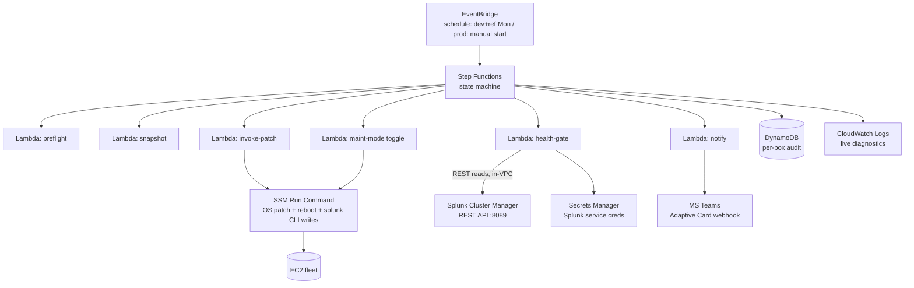
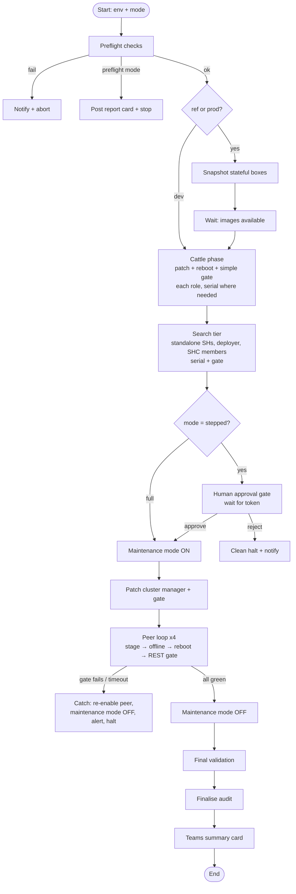

# Automated OS Patching — Architecture Design

**System:** Cyclical, tiered OS-level patching for the distributed Splunk deployment on AWS.
**Scope:** OS/package patching only. Not Splunk version upgrades.
**Footprint goal:** Serverless. No orchestration server to own or patch.
**Status:** Design. Field names / REST endpoints flagged as version-dependent must be verified before implementation.

---

## 1. Requirements (as agreed)

| # | Requirement | Design consequence |
|---|---|---|
| R1 | Small footprint, nothing that is itself a pet | Serverless: Step Functions + Lambda + SSM. No Ansible control node in the critical path. |
| R2 | Cattle fully unattended; pets verified & gated | One state machine, tier-aware branching. |
| R3 | Human approval **before the indexer phase** by default | Approval gate (task-token wait) in `stepped` mode. |
| R4 | A `full` switch for hands-off runs; a preflight-only mode | `mode` input: `stepped` \| `full` \| `preflight`. |
| R5 | Live diagnostic visibility as it runs | Step Functions execution graph + CloudWatch + interim audit writes. |
| R6 | Snapshots before ref & prod for rebuild/rollback | Snapshot state gates patching; DLM auto-expiry. |
| R7 | Per-box audit trail | DynamoDB table keyed by run + instance. |
| R8 | Teams card summary | Notify Lambda → Teams webhook (Adaptive Card). |
| R9 | dev scheduled/auto, ref scheduled/stepped, prod manual-start/hard-gated | Same machine, three configs + trigger types. |

---

## 2. Why this shape (and not the alternatives)

| Option | Verdict | Reason |
|---|---|---|
| **Ansible** | Not the orchestrator | Adds a control node you must maintain, hold SSH inventory/creds on — grows footprint (R1). It *can* sequence (`serial: 1`) and *can* back out (`block/rescue`), but gives no advantage over serverless here. Keep it for config mgmt if used elsewhere. |
| **Single Lambda** | Insufficient alone | 15-min hard limit can't span four sequential peer reboots + resync; can't hold state across a reboot. |
| **SSM Automation runbook** | Viable, lighter | Good, but weaker on human-approval gating, branching, and audit richness than Step Functions. |
| **Step Functions + small Lambdas** | **Chosen** | Native wait/poll loops (health gates), per-state Retry/Catch (backout), task-token approval state (the prod harness), automatic execution logging (half the audit trail), zero servers. |

**On "can it back out?"** — no orchestrator auto-undoes a patch. "Backout" = **restore the box from its pre-patch image** (package/kernel downgrade is fragile-to-impossible). This is *why* R6 (snapshots) is the real safety net, not a nice-to-have. In Step Functions, a `Catch` on the peer loop runs an explicit recovery branch (re-enable peer, disable maintenance mode, alert, halt) — the equivalent of Ansible's `rescue`.

---

## 3. Component architecture

**Responsibility split (the key design decision):**

- **Reads / decisions → Splunk REST API** from an in-VPC Lambda, creds from Secrets Manager. Structured JSON, robust to gate on. This is the health gate.
- **Writes / actions → SSM Run Command** (OS patch, reboot, `splunk enable/disable maintenance-mode`, `splunk offline`). Uses the instance role; every invocation logged in SSM history; deterministic.

Net effect: Splunk credentials are used in exactly **one** place (the health-gate Lambda), never land on instances, and the destructive actions have an immutable SSM audit record.

---

## 4. Tier model → state machine

| Tier | Boxes | Automation | Gate |
|---|---|---|---|
| **Cattle** | forwarders, MISP, Zeek, standalone SHs, deployer | Fully unattended. Patch + `RebootIfNeeded`. | Simple "back Online in SSM + service responds". |
| **Pets — SHC** | 3 SHC members | Serial, staged (`NoReboot`) + controlled reboot. | REST: captain present, all 3 members Up. |
| **Pets — Manager** | cluster manager | Patched first in indexer phase, on its own. | REST: cluster green before proceeding. |
| **Pets — Peers** | 4 indexers | Serial loop: stage → `offline` → reboot → **gate**. | REST: peer Up + searchable + bucket count recovered + SF/RF met + no fixup. |

---

## 5. The health gate (done correctly)

**Not disk bytes.** Bucket sizes drift with ongoing ingestion and hot→warm rolling; a rejoining peer sees transient churn. Raw size is a noisy signal with meaningless tolerances.

**Instead, ask the cluster manager the questions that actually matter.** After a peer reboots, the gate Lambda polls (with retry/backoff) until *all* of these hold, or a timeout trips the backout:

1. **Peer status = `Up`** (the peer has re-registered).
2. **Peer `is_searchable` = true** (its buckets are participating in search, not just present).
3. **Peer bucket count ≈ pre-patch value** — the discrete, robust version of your "data is the same" instinct. A count that returns to baseline means the peer's data is whole; bytes never gave you that cleanly.
4. **Cluster search factor Met AND replication factor Met.**
5. **No pending fixup / bucket-remediation tasks.**

Only when 1–5 are satisfied does the machine advance to the next peer.

> Version caveat: the endpoints (`/services/cluster/manager/peers`, `/services/cluster/manager/info`) and their JSON field names changed with the manager/peer terminology shift across Splunk releases (older builds use `master`/`slave`). Confirm the exact paths and field names for our running version before coding the gate. The *logic* above is version-independent; the *field names* are not.

**Cattle gate** is deliberately trivial — SSM reports the instance back Online and a lightweight service probe (e.g. the box's service port responds). No Splunk REST needed for cattle.

---

## 6. Snapshot & rollback strategy

- Runs as an **early state**, for **ref and prod only** (dev skips — it's disposable).
- `aws ec2 create-image --no-reboot` on the **config-stateful** boxes: cluster manager + 3 SHC members, at minimum. `--no-reboot` means no disturbance to the running box.
- Tag every image with the **run ID** and environment, so a bad run's rollback set is unambiguous.
- **Gate on completion:** the machine will not enter any patch phase until snapshots report available. Rollback exists *before* risk is taken.
- **Auto-expiry** via a Data Lifecycle Manager policy (e.g. retain 7–14 days) so images don't accumulate cost.
- **Open question (see §13):** whether to also snapshot the 4 indexer peers. Their *data* is replicated (redundant), but a *simultaneous multi-peer bad patch* is the tail risk a snapshot would cover. Cost vs. tail-risk call.

---

## 7. Run modes & the approval gate

`mode` input parameter:

- **`preflight`** — run all readiness checks (cluster green, SSM nodes Online, both OS baselines present, snapshot permissions valid), post a report card, **change nothing**. Your dry run.
- **`stepped`** (default) — full run, but **pause at the approval gate before the indexer phase**. The gate is a task-token state: the machine emits a Teams card / notification and waits for an explicit **approve** (proceed) or **reject** (clean halt). This is R3.
- **`full`** — identical, but the Choice state routes *past* the approval gate. Hands-off. Intended for dev, and for ref/prod only once trust is established.

**Approval mechanism — two build tiers:**
- *v1 (simple):* notification card + human approves/rejects the paused execution in the Step Functions console.
- *v2 (slick):* Teams **Actionable Message** with Approve/Reject buttons → API Gateway → Lambda calling `SendTaskSuccess` / `SendTaskFailure` with the token. More setup; do it after v1 works.

---

## 8. Orchestration flow

Every box in every phase writes an audit row on entry and on completion, so a live run is inspectable both in the Step Functions graph and in DynamoDB.

---

## 9. Audit trail (DynamoDB)

Table `patch-audit`, on-demand capacity.

| Item type | PK (`run_id`) | SK (`record`) | Key attributes |
|---|---|---|---|
| Run meta | `ref#2026-08-17T09:00` | `RUN#META` | environment, mode, trigger (schedule/manual), operator, approval status + approver, start/end, overall result |
| Per-box | `ref#2026-08-17T09:00` | `INSTANCE#i-0f9ac165312c8ab0d` | name, tier, role, phase, pre_patch_health (JSON), packages_updated, reboot_time, post_patch_health (JSON), bucket_count_before/after, status (`success`\|`failed`\|`skipped`\|`backed_out`), error |

This is the "if it goes wrong, we know exactly what happened to which box, when, and in what state" record — and directly useful as change evidence.

---

## 10. Teams notifications

- **Interim (optional):** phase-transition pings ("cattle complete", "awaiting approval") for live visibility.
- **Approval card:** environment, what's about to happen (indexer phase), pre-phase cluster health snapshot; Approve/Reject (v2).
- **Final summary card:** environment, mode, operator, duration, per-tier pass/fail counts, any failed instances by ID, links to the Step Functions execution and the DynamoDB run record.

---

## 11. Environment configuration

| | Trigger | Default mode | Snapshots | Approval gate | Notes |
|---|---|---|---|---|---|
| **dev** | EventBridge, Monday | `full` | no | none | Proves the pipeline end-to-end, disposable. |
| **ref** | EventBridge, Monday | `stepped` | yes | before indexer phase | Cattle unattended, pets gated. Soak-tests before prod. |
| **prod** | **Manual start** | `stepped` | yes (mandatory) | before indexer phase (hard) | Kicked off by a human once dev+ref are green and business allows — no clash with active usage. |

Same state machine, parameterised. dev and ref run automatically Monday morning; you arrive, confirm both went green, then manually launch prod when the team isn't relying on the system.

---

## 12. Security & least privilege

- **Splunk service account**, not a human admin login, in Secrets Manager — scoped to the minimum capabilities the gate needs (read cluster status; toggle maintenance mode if you move that write to REST). Rotate via Secrets Manager.
- **Health-gate Lambda in-VPC**, security group allowing egress to the cluster manager management port (8089) only. Confirm this path exists before banking on REST (see §13).
- **Instance roles** carry the SSM permissions for patching; the Step Functions role is scoped to invoke exactly its Lambdas + the specific SSM documents.
- **`ec2:CreateImage`** and DLM scoped to the patch tags.
- Secrets Manager resource policy limits which Lambda role can read the Splunk secret.

---

## 13. Build roadmap (de-risked, incremental)

1. **Read-only first.** Build the preflight + health-gate Lambda + Teams card. Run in `preflight` mode against dev and ref. Changes nothing — proves the REST gate, cred path, and reporting.
2. **Cattle on dev.** Automate patch + reboot + simple gate for the disposable tier. Scheduled.
3. **Pets on dev, `full` mode.** Add maintenance-mode toggle, `offline`, the peer loop and REST gate. dev is safe to run hands-off.
4. **Snapshots + approval gate.** Add the snapshot state and the task-token approval. Enable **ref** in `stepped` mode, scheduled Monday.
5. **Prod.** Manual start, mandatory snapshots, hard approval gate. Runs only after dev+ref are consistently green.

Each step is independently useful and independently reversible.

---

## 14. Open decisions

- **Approval UX:** v1 (Step Functions console approve) now, v2 (Teams Actionable buttons) later — confirm you're happy starting with v1.
- **Splunk auth:** stand up a dedicated least-privilege service account (recommended) vs. reuse an existing admin — decides Secrets Manager contents and IAM.
- **Lambda→8089 network path:** confirm an in-VPC Lambda can reach the cluster manager's management port, or whether we route the health reads through SSM instead.
- **Indexer peer snapshots:** skip (data is replicated) vs. include (covers the multi-peer bad-patch tail risk) — a cost/safety judgement.
- **Snapshot retention window** for the DLM policy (7 vs 14 days).
