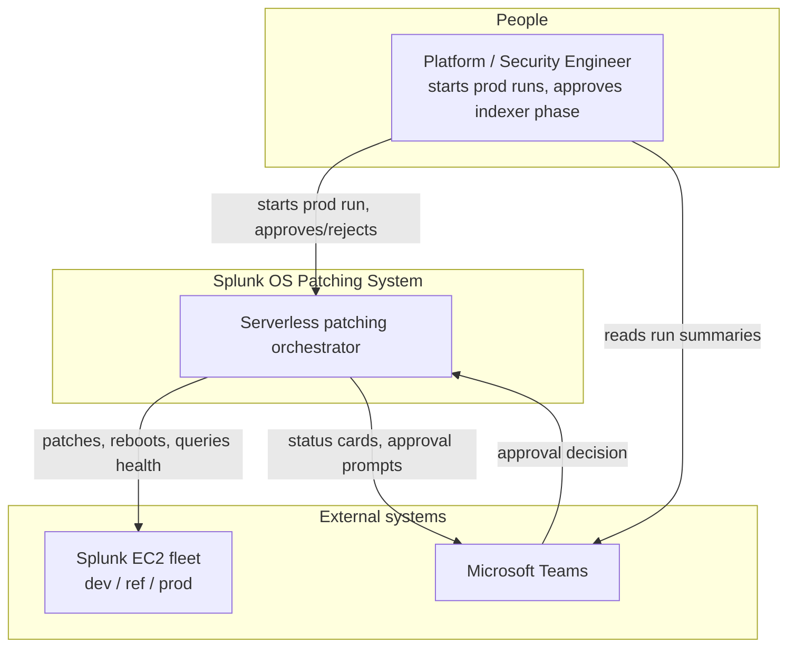
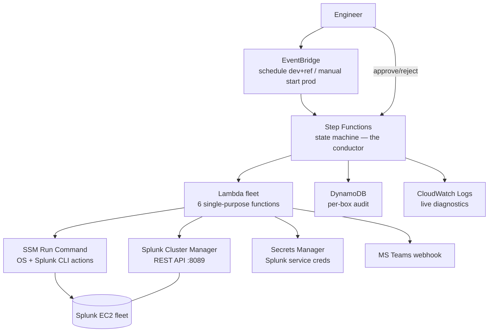
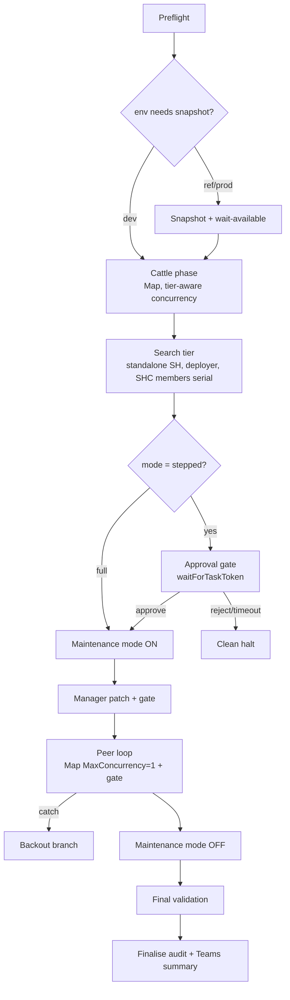
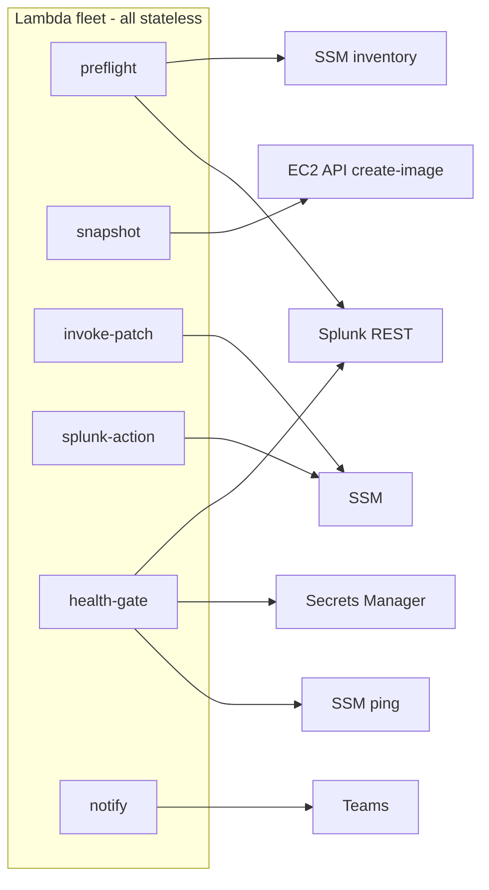
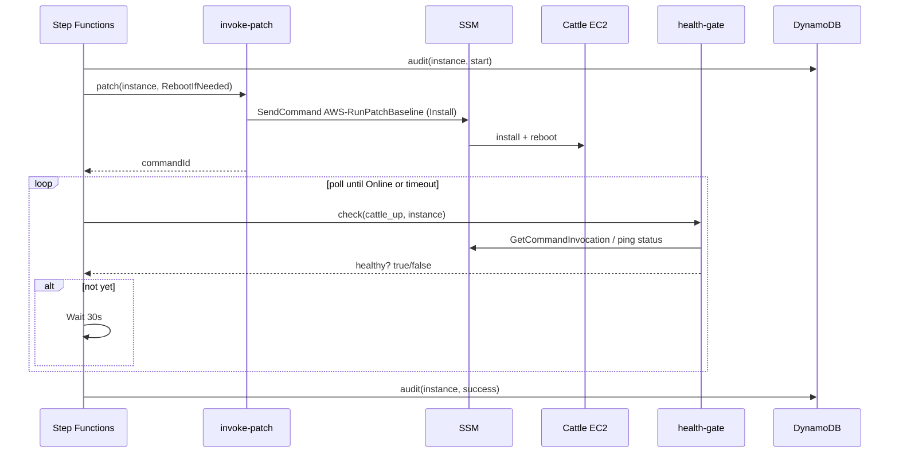
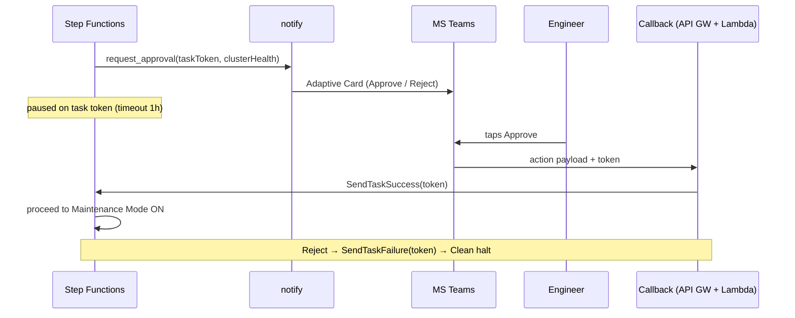
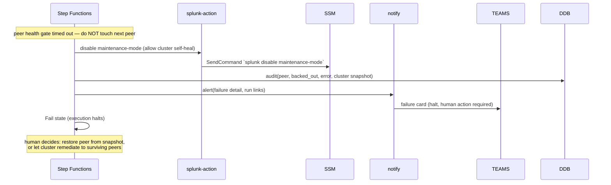

# Automated OS Patching System — Design & Implementation Specification

**Version:** 1.0 (design)
**Purpose of this document:** A self-contained specification an engineer or code-generation model can build from. It defines the architecture (C4 levels 1–3), the runtime behaviour (sequence diagrams), representative state-machine definitions, per-component contracts, the data model, and the security and tagging prerequisites.
**Scope:** Operating-system / package patching of a distributed Splunk deployment on AWS. **Not** Splunk version upgrades.

> **Implementer note — read first.** Two classes of detail in this document are deliberately *logical, not literal*, and MUST be verified against the live environment before coding:
> 1. **Splunk REST endpoints and JSON field names** — these changed with the `master`/`slave` → `manager`/`peer` terminology shift across Splunk versions. The *checks* described here are version-independent; the *exact paths and field names* are not. Confirm against the running version.
> 2. **Instance inventory** — the system discovers targets by **tag**, not hard-coded IDs (see §11, Tagging Standard). Do not embed instance IDs in code.

---

## 1. Problem & solution summary

A distributed Splunk cluster cannot be patched like a fleet of stateless web servers: its indexer peers hold replicated data and its search heads coordinate as a cluster, so rebooting them carelessly (or in parallel) risks data availability. AWS Systems Manager Patch Manager is not Splunk-aware and would happily reboot all peers at once.

The solution is a **serverless orchestrator** that encodes Splunk-aware sequencing: disposable nodes are patched unattended; stateful cluster nodes are patched one at a time, each behind a health gate that asks the cluster manager whether it is safe to continue, with a human approval checkpoint before the indexer phase and image snapshots as the rollback path.

**Design principles**
- **Small footprint.** Serverless only. No orchestration server that is itself a pet to maintain.
- **Intelligence in the conductor.** All sequencing/state lives in one Step Functions state machine; every Lambda is small, stateless, single-purpose.
- **Gate, don't guess.** Progress past a stateful node only when the cluster confirms health.
- **Snapshot = rollback.** OS patch rollback means restore-from-image, not package downgrade.
- **Least privilege, single cred locus.** Splunk credentials are read by exactly one component.

---

## 2. Target topology (context for the implementer)

The Splunk deployment being patched consists of these roles (per environment: dev, ref, prod):

| Role | Count (typical) | Tier | Handling |
|---|---|---|---|
| Indexer cluster manager | 1 | pet-manager | Patched first in indexer phase, alone. |
| Indexer peers | 4 | pet-peer | Serial loop, maintenance mode + graceful offline + gate. |
| Search head cluster (SHC) members | 3 | pet-shc | Serial, one at a time + gate. |
| SHC deployer | 1 | cattle | Not in live search path. |
| Standalone search heads | 2 | cattle | Independent reboots. |
| Heavy forwarders | 2 | cattle | Ingestion tier, serial. |
| MISP (threat intel) | 1 | cattle | Independent. |
| Zeek (network sensors) | 3 (1 master, 2 workers) | cattle | Workers serial. |
| Ansible / management node | 1 | cattle | Independent (verify environment scope). |

**Two concepts the health gate depends on:**
- **Replication Factor (RF):** number of raw-data copies across peers.
- **Search Factor (SF):** number of *searchable* copies. Patching must never drop the cluster below SF/RF — hence one peer at a time.

---

## 3. C4 Level 1 — System Context

*(Rendered as a C4-style flowchart for reliable rendering.)*



---

## 4. C4 Level 2 — Container



**Container responsibilities**

| Container | Responsibility | Notes |
|---|---|---|
| EventBridge | Triggers runs. Cron for dev+ref; prod started manually. | Passes `{environment, mode}` as input. |
| Step Functions | Holds all sequencing, waiting, branching, retry/catch, approval. Does no direct work. | The only stateful component at runtime. |
| Lambda fleet | Six stateless functions (see §8). | None holds cross-invocation state. |
| SSM Run Command | Executes actions on instances (patch, reboot, splunk CLI). | Uses instance roles; fully logged. |
| Splunk REST API | Source of truth for cluster health. | Read by the health-gate Lambda only. |
| Secrets Manager | Stores the Splunk service-account credential. | Read by the health-gate Lambda only. |
| DynamoDB | Per-box + per-run audit trail. | Written by the state machine / Lambdas. |
| Teams | Human-facing surface (summaries, approvals). | Adaptive Cards. |

---

## 5. C4 Level 3 — Components

**Inside the state machine (phases as logical components):**



**The Lambda fleet (components):**



---

## 6. Sequence diagrams

### 6.1 Cattle box patch (unattended)



### 6.2 Indexer peer cycle (the critical path)

```mermaid
sequenceDiagram
    participant SFN as Step Functions
    participant IP as invoke-patch
    participant SA as splunk-action
    participant SSM
    participant PEER as Indexer peer
    participant HG as health-gate
    participant SPL as Cluster Mgr REST
    participant DDB

    Note over SFN: maintenance mode already ON; manager already patched
    SFN->>DDB: audit(peer, start, pre_health, bucket_count_before)
    SFN->>IP: stagePatch(peer, NoReboot)
    IP->>SSM: SendCommand Install NoReboot
    SSM->>PEER: packages staged (no reboot)
    SFN->>SA: offline(peer)
    SA->>SSM: SendCommand `splunk offline`
    SSM->>PEER: graceful offline (reassign primaries)
    SFN->>IP: reboot(peer)
    IP->>SSM: SendCommand `sudo reboot`
    SSM->>PEER: reboot (picks up staged kernel/pkgs)
    loop poll until green or timeout
        SFN->>HG: check(peer_health, peer, expected_bucket_count)
        HG->>SPL: GET /cluster/manager/peers + /info
        SPL-->>HG: status, is_searchable, bucket_count, SF/RF met, fixup list
        HG-->>SFN: healthy? true/false
        alt not yet
            SFN->>SFN: Wait 30s (bounded attempts)
        end
    end
    alt healthy
        SFN->>DDB: audit(peer, success, post_health, bucket_count_after)
    else timeout
        SFN->>SFN: Catch → Backout
    end
```

### 6.3 Approval gate (stepped mode)



### 6.4 Backout / rescue



> **Backout rationale:** if a peer will not return healthy, the safe recovery is to **disable maintenance mode so the cluster re-replicates the missing peer's buckets to surviving peers** (restoring SF/RF), alert a human, and halt. The machine never tries to force-repair a broken box; it makes the cluster safe and hands off.

---

## 7. State machine — representative definitions

Full ASL is left to the implementer; these are the states whose correctness matters most.

**Mode branch + approval gate:**
```json
"ModeChoice": {
  "Type": "Choice",
  "Choices": [
    { "Variable": "$.mode", "StringEquals": "full", "Next": "MaintenanceModeOn" }
  ],
  "Default": "IndexerApprovalGate"
},
"IndexerApprovalGate": {
  "Type": "Task",
  "Resource": "arn:aws:states:::lambda:invoke.waitForTaskToken",
  "Parameters": {
    "FunctionName": "patch-notify",
    "Payload": {
      "action": "request_approval",
      "environment.$": "$.environment",
      "taskToken.$": "$$.Task.Token",
      "clusterHealth.$": "$.preIndexerHealth"
    }
  },
  "TimeoutSeconds": 3600,
  "Next": "MaintenanceModeOn",
  "Catch": [
    { "ErrorEquals": ["States.Timeout", "ApprovalRejected"], "Next": "CleanHalt" }
  ]
}
```

**Serial peer loop (Map, concurrency 1, with catch → backout):**
```json
"PeerLoop": {
  "Type": "Map",
  "ItemsPath": "$.indexerPeers",
  "MaxConcurrency": 1,
  "ItemSelector": {
    "peer.$": "$$.Map.Item.Value",
    "environment.$": "$.environment",
    "runId.$": "$.runId"
  },
  "ItemProcessor": {
    "StartAt": "StagePatch",
    "States": {
      "StagePatch":   { "Type": "Task", "Resource": "...invoke-patch", "Parameters": { "op": "patch_noreboot" }, "Next": "OfflinePeer" },
      "OfflinePeer":  { "Type": "Task", "Resource": "...splunk-action", "Parameters": { "verb": "offline" }, "Next": "RebootPeer" },
      "RebootPeer":   { "Type": "Task", "Resource": "...invoke-patch", "Parameters": { "op": "reboot" }, "Next": "InitAttempts" },
      "InitAttempts": { "Type": "Pass", "Result": 0, "ResultPath": "$.attempts", "Next": "PollPeerHealth" },
      "PollPeerHealth": {
        "Type": "Task", "Resource": "...health-gate",
        "Parameters": { "checkType": "peer_health", "peer.$": "$.peer" },
        "ResultPath": "$.health", "Next": "PeerHealthy"
      },
      "PeerHealthy": {
        "Type": "Choice",
        "Choices": [
          { "Variable": "$.health.healthy", "BooleanEquals": true, "Next": "RecordSuccess" },
          { "Variable": "$.attempts", "NumericGreaterThanEquals": 40, "Next": "PeerTimeout" }
        ],
        "Default": "WaitAndRetry"
      },
      "WaitAndRetry": { "Type": "Wait", "Seconds": 30, "Next": "IncAttempts" },
      "IncAttempts": {
        "Type": "Pass",
        "Parameters": { "attempts.$": "States.MathAdd($.attempts, 1)", "peer.$": "$.peer" },
        "Next": "PollPeerHealth"
      },
      "RecordSuccess": { "Type": "Task", "Resource": "...audit-writer or SDK", "End": true },
      "PeerTimeout": { "Type": "Fail", "Error": "PeerHealthGateTimeout" }
    }
  },
  "Catch": [ { "ErrorEquals": ["States.ALL"], "ResultPath": "$.error", "Next": "Backout" } ],
  "Next": "MaintenanceModeOff"
}
```

**Key invariants the implementer must preserve:**
- `MaxConcurrency: 1` on the peer loop is non-negotiable — parallelism here risks data loss.
- Maintenance mode ON before the loop, OFF after (and OFF in the backout branch).
- Manager patched *before* the loop, not inside it.
- The gate's success condition is the full health check (§9), not merely "instance reachable".

---

## 8. Lambda component contracts

All Lambdas: Python 3.x + boto3, stateless, structured JSON in/out, log to CloudWatch, write their own audit row where relevant.

### 8.1 `patch-preflight`
- **Responsibility:** Verify a run can safely proceed. Change nothing.
- **Input:** `{ environment, mode }`
- **Checks:** all tagged instances are SSM-managed and Online; both OS patch baselines (Amazon Linux + Ubuntu) exist and are associated with the environment's patch group; cluster health is green (via REST); (ref/prod) create-image permissions valid.
- **Output:** `{ ready: bool, findings: [...], inventory: { cattle: [...], pet_shc: [...], pet_manager: [...], pet_peers: [...] } }`
- **IAM:** `ssm:DescribeInstanceInformation`, `ssm:DescribePatchBaselines`, `ec2:DescribeInstances`, `secretsmanager:GetSecretValue` (health check), read Splunk REST.

### 8.2 `patch-snapshot`
- **Responsibility:** Create AMIs of config-stateful boxes (manager + SHC members; optionally peers — see §14).
- **Input:** `{ environment, runId, targets: [...] }`
- **Action:** `ec2:CreateImage --no-reboot`, tag with `runId`, `environment`, `PatchSnapshot=true`.
- **Output:** `{ images: [{instanceId, imageId}], status }`
- **IAM:** `ec2:CreateImage`, `ec2:CreateTags`. Completion polled by the state machine (`ec2:DescribeImages`) before patching proceeds.

### 8.3 `patch-invoke-patch`
- **Responsibility:** OS actions via SSM.
- **Input:** `{ instanceId, op: "patch_reboot" | "patch_noreboot" | "reboot" }`
- **Action:** `patch_*` → `SendCommand AWS-RunPatchBaseline` (Operation=Install, RebootOption per op); `reboot` → `SendCommand AWS-RunShellScript ("sudo reboot")`.
- **Output:** `{ commandId, instanceId }`
- **IAM:** `ssm:SendCommand` on the specific documents + tagged instances.

### 8.4 `patch-splunk-action`
- **Responsibility:** Splunk CLI verbs via SSM (the write actions).
- **Input:** `{ instanceId, verb: "enable_maintenance" | "disable_maintenance" | "offline" | "online" | "restart" }`
- **Action:** `SendCommand AWS-RunShellScript` running the corresponding `splunk` CLI. If the verb needs Splunk auth, inject from Secrets Manager at runtime; do not persist on the box.
- **Output:** `{ commandId, verb, instanceId }`
- **IAM:** `ssm:SendCommand`; `secretsmanager:GetSecretValue` if CLI auth needed.
- **Note:** `offline` MUST be plain `splunk offline` (graceful), never `--enforce-counts` (permanent decommission + full remediation).

### 8.5 `patch-health-gate`
- **Responsibility:** The decision engine. Answer "is this target healthy enough to proceed?"
- **Input:** `{ checkType, instanceId | peer | environment, expected_bucket_count? }`
- **checkType values:**
  - `cattle_up` — SSM ping Online + optional service-port probe.
  - `cluster_green` — SF met, RF met, all data searchable, no fixup.
  - `shc_health` — captain elected, all members Up.
  - `peer_health` — peer status Up, `is_searchable` true, bucket_count ≈ expected, SF/RF met, no pending fixup.
- **Data sources:** Splunk REST API (creds from Secrets Manager), SSM ping.
- **Output:** `{ healthy: bool, details: {...}, checked_at }`
- **IAM:** `secretsmanager:GetSecretValue`, `ssm:DescribeInstanceInformation`, `ssm:GetCommandInvocation`. **Runs in-VPC** with a security group permitting egress to the cluster manager on 8089.
- **Caveat:** exact REST paths/fields are version-specific (see top note). Implement a thin adapter so the version mapping lives in one place.

### 8.6 `patch-notify`
- **Responsibility:** Human-facing messaging + approval handling.
- **Input:** `{ action: "summary" | "phase" | "request_approval" | "alert", payload, taskToken? }`
- **Action:** POST Adaptive Card to Teams webhook. For `request_approval`, emit a card carrying the task token route (v2) or instruct console approval (v1).
- **Output:** `{ delivered: bool }`
- **IAM:** `secretsmanager:GetSecretValue` (webhook URL) or SSM Parameter.

---

## 9. Health-gate logic (authoritative)

For `peer_health`, ALL must hold before proceeding:
1. Peer `status == Up`.
2. Peer `is_searchable == true`.
3. Peer `bucket_count` within tolerance of the pre-patch baseline captured in audit (discrete count; **not** disk bytes).
4. Cluster `search_factor_met == true` AND `replication_factor_met == true`.
5. No pending fixup / bucket-remediation tasks attributable to the rejoining peer.

Poll with fixed backoff (e.g. 30s) up to a bounded attempt count (e.g. 40 ≈ 20 min); exceeding it routes to backout. Do **not** gate on raw disk usage — it drifts with ingestion and rejoin churn and yields false negatives.

---

## 10. Data model — DynamoDB `patch-audit`

On-demand capacity. Composite key.

| Item | PK `run_id` | SK `record` | Attributes |
|---|---|---|---|
| Run meta | `{env}#{ISO8601}` | `RUN#META` | environment, mode, trigger, operator, approval_status, approver, started_at, ended_at, result |
| Per-box | `{env}#{ISO8601}` | `INSTANCE#{instanceId}` | name, tier, role, phase, pre_patch_health(JSON), packages_updated, reboot_time, post_patch_health(JSON), bucket_count_before, bucket_count_after, status(`success`\|`failed`\|`skipped`\|`backed_out`), error |

Written on entry (start) and completion of each box, giving a live and post-hoc "what happened to which box, when, in what state" record — and change evidence.

---

## 11. Tagging Standard (prerequisite — the system keys off this)

Every in-scope instance must carry:

| Tag | Values | Purpose |
|---|---|---|
| `Environment` | `dev` \| `ref` \| `prod` | Run targeting + patch group. |
| `PatchTier` | `cattle` \| `pet-shc` \| `pet-manager` \| `pet-peer` | Determines handling path. |
| `SplunkRole` | `indexer` \| `shc-member` \| `cluster-manager` \| `deployer` \| `search-head` \| `heavy-forwarder` \| `misp` \| `zeek` \| `management` | Ordering + diagnostics. |
| `PatchGroup` | e.g. `splunk-ref` | SSM patch baseline association. |

Preflight discovers targets by these tags. Adding/removing a box needs no code change — only correct tags.

---

## 12. Configuration model

Per-environment config (SSM Parameter Store or a config file), consumed at run start:

```json
{
  "dev":  { "schedule": "cron(0 6 ? * MON *)", "defaultMode": "full",    "snapshot": false, "approvalGate": false, "peerGateAttempts": 40, "peerGateInterval": 30 },
  "ref":  { "schedule": "cron(0 6 ? * MON *)", "defaultMode": "stepped", "snapshot": true,  "approvalGate": true,  "peerGateAttempts": 40, "peerGateInterval": 30 },
  "prod": { "schedule": null,                  "defaultMode": "stepped", "snapshot": true,  "approvalGate": true,  "snapshotPeers": true, "manualStartOnly": true }
}
```

- **dev:** scheduled, `full`, no snapshot, no gate.
- **ref:** scheduled, `stepped`, snapshot on, approval gate on.
- **prod:** no schedule (manual start), `stepped`, mandatory snapshot (incl. peers), hard approval gate.

`mode` may be overridden per-run at trigger time: `stepped` | `full` | `preflight`.

---

## 13. Security & IAM model

- **Splunk service account** (not a human admin) in Secrets Manager, scoped to the minimum capabilities the gate needs; rotated via Secrets Manager.
- **Single credential locus:** only `patch-health-gate` (and `splunk-action` if REST writes are chosen) reads the Splunk secret.
- **VPC:** `patch-health-gate` runs in-VPC; SG egress to cluster manager `:8089` only.
- **Instance roles:** carry SSM patching permissions; no long-lived creds on instances.
- **Step Functions role:** scoped to invoke exactly its Lambdas + specific SSM documents.
- **Snapshot perms:** `ec2:CreateImage`/`CreateTags` scoped to patch tags; DLM lifecycle policy auto-expires images (7–14 days).
- **Least privilege everywhere:** each Lambda role grants only its own calls (§8).

---

## 14. Error handling strategy

- **Transient errors** (SSM throttling, REST timeout): ASL `Retry` with exponential backoff on the relevant Task states.
- **Terminal errors on a peer:** `Catch` on the peer loop → Backout branch (disable maintenance mode, audit, alert, Fail).
- **Global catch:** top-level `Catch` → failure summary card + Fail, so no run ends silently.
- **Approval timeout / rejection:** Clean-halt branch (no cluster changes made yet at that point).
- **Idempotency:** patch operations are naturally idempotent; snapshot and audit writes keyed by `runId` to avoid duplicates on retry.

---

## 15. Build roadmap (incremental, de-risked)

1. **Prerequisites & read-only.** Tagging standard applied; service account + Secrets Manager; DynamoDB table; confirm SSM manages all boxes; confirm in-VPC Lambda → `:8089`. Build `preflight`, `health-gate`, `notify`. Wire a machine that only checks readiness + posts a card. **Touches nothing.**
2. **Cattle on dev.** Add `invoke-patch`; automate patch+reboot+`cattle_up` gate. Scheduled.
3. **Pets on dev, `full` mode.** Add `splunk-action`; build manager patch, maintenance-mode toggle, serial peer loop + gate + backout.
4. **Snapshots + approval.** Add `snapshot` state and the task-token gate. Promote **ref** (stepped, scheduled).
5. **Prod.** Manual start, mandatory snapshots (incl. peers), hard gate. Enable only after dev+ref are consistently green.

Each slice is independently useful and reversible.

---

## 16. Assumptions & open decisions

- **Approval UX:** v1 = Step Functions console approval; v2 = Teams Actionable Message + API Gateway callback. Start v1.
- **Splunk write actions:** via SSM CLI (default here) vs REST — decides whether `splunk-action` needs the Splunk secret.
- **Lambda→8089 path:** confirm reachable in-VPC; fallback is CLI-over-SSM health reads (brittler text parsing).
- **Peer snapshots:** dev/ref skip (data replicated); prod includes (covers multi-peer bad-patch tail risk). Confirm cost tolerance.
- **DLM retention window:** 7 vs 14 days.
- **REST version mapping:** confirm exact endpoints/fields for the running Splunk version and encapsulate in the health-gate adapter.

---

## 17. Glossary

- **Cattle / pet:** disposable interchangeable node vs. stateful hand-tended node — determines handling.
- **RF / SF:** replication factor (raw copies) / search factor (searchable copies) enforced by the cluster manager.
- **Bucket / fixup:** a directory of indexed events / the cluster manager's re-replication work to restore SF/RF.
- **Maintenance mode:** cluster-manager switch that suppresses automatic fixup during planned work.
- **`splunk offline`:** graceful peer shutdown that reassigns primaries and lets searches finish.
- **Task token / `waitForTaskToken`:** Step Functions pattern that pauses a run until an external callback (the approval mechanism).
